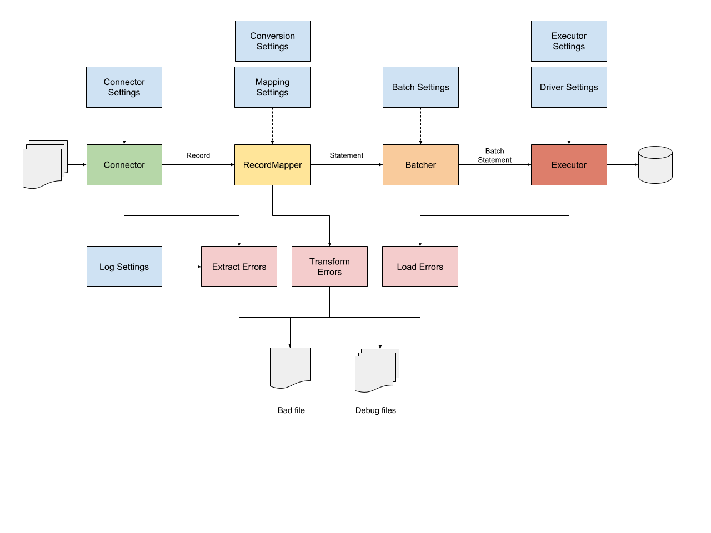

# DataStax Loader Workflow Engine

The DataStax Workflow Engine is the component responsible for the orchestration of a loading operation.

## Main Features

* Configuration: The engine collects user-supplied settings, merges them with default values and 
configures the loading operation to run.
* Connection: The engine handles the driver connection to DSE and manages driver-specific settings 
(contact points, keyspace, table, consistency level, etc.). 
It also supports authentication and SSL encryption.
* Conversion: The engine handles data type conversions, e.g. boolean, number, date conversions 
from anything (typically, strings or raw bytes as emitted by a connector) to appropriate internal 
representations (typically, Java Temporal or Number objects). It also handles `NULL` and `UNSET` values.
* Mapping: The engine analyzes metadata gathered from the driver and infers the appropriate `INSERT` prepared statement,
then crosses this information with user-supplied information about the data source to infer what are the bound 
variables to use.
* Monitoring: the engine reports metrics about all its internal components, mainly the connector and the bulk executor.
* Error Handling: the engine handles errors from both connectors and the bulk executor, and reports read, parse and 
write failures. These are redirected to a configurable "bad file" that contains sources that could not be loaded.

## Workflow Overview

## Engine Configuration

The following engine components can be configured:

*  driver

    Driver-specific settings.
 
    * contact-points
    
         The contact points to use for the initial connection to the cluster
         This must be a list of strings with each contact point specified as "host:port". If the host is
         a DNS name that resolves to multiple A-records, all the corresponding addresses will be used.
         Do not use "localhost" as the host name (since it resolves to both IPv4 and IPv6 addresses on
         some platforms).
         Note that the current version of Cassandra (3.11) requires all nodes in a cluster to share the
         same port.
         Defaults to `["127.0.0.1:9042"]`.

    * protocol
    
        Protocol-specific settings.

        * version
       
            The native protocol version to use.
            Valid values are: `V3`, `V4`, `DSE_V1`.
            This option is not required. If it is absent, the driver will negotiate it.

        * compression
        
            The compression algorithm to use.
            Valid values are: `NONE`, `LZ4`, `SNAPPY`.
            Defaults to `LZ4`.

    * pooling
    
        Pooling-specific settings. 
    
        The driver maintains a connection pool to each node, 
        according to the distance assigned to it by the load balancing policy. 
        If the distance is `IGNORED`, no connections are maintained.

        * local
        
            Pooling settings for nodes at `LOCAL` distance.

            * connections
         
                The number of connections in the pool.
                Defaults to 1.

            * requests
                
                The maximum number of requests that can be executed concurrently on a connection.
                This must be between 1 and 32768.
                Defaults to 32768.

        * remote
        
            Pooling settings for nodes at `REMOTE` distance.

            * connections
                
                The number of connections in the pool.
                Defaults to 1.

            * requests = 1024
                
                The maximum number of requests that can be executed concurrently on a connection.
                This must be between 1 and 32768.
                Defaults to 1024.

        * heartbeat
               
           The heartbeat interval. If a connection stays idle for that duration (no reads), the driver
           sends a dummy message on it to make sure it's still alive. If not, the connection is
           trashed and replaced.
           Defaults to 30 seconds.

    * query
    
        Query-related settings.

        * consistency

            The consistency level to use for both reads and writes.
            Allowed values are:
            `ANY`, `LOCAL_ONE`, `ONE`, `TWO`, `THREE`, `LOCAL_QUORUM`, `QUORUM`, `EACH_QUORUM`, `ALL`.
            Defaults to `LOCAL_ONE`.

        * serial-consistency

            The serial consistency level to use for writes.
            The allowed values are: `SERIAL` and `LOCAL_SERIAL`.
            Only applicable if the data is inserted using lightweight transactions,
            ignored otherwise.
            Defaults to `LOCAL_SERIAL`.

        * fetch-size

            The page size. This controls how many rows will be retrieved simultaneously in a single
            network round trip (the goal being to avoid loading too many results in memory at the same
            time).
            Only applicable in read scenarios, ignored otherwise.
            Defaults to 5000.

        * idempotence
        
           The default idempotence of statements generated by the loader.
           Defaults to `true`.

    * socket
    
        Socket-related settings.

        * read-timeout = 12 seconds

            How long the driver waits for a request to complete. This is a global limit on the duration
            of a session.execute() call, including any internal retries the driver might do.

    * timestamp-generator
    
        The fully-qualified class name of the timestamp generator to use.
        
        Built-in options are:
        
        - AtomicTimestampGenerator: timestamps are guaranteed to be unique across all client threads.
        - ThreadLocalTimestampGenerator: timestamps that are guaranteed to be unique within each
        thread only.
        - ServerSideTimestampGenerator: do not generate timestamps, let the server assign them.
        
        Defaults to `com.datastax.driver.core.AtomicMonotonicTimestampGenerator`.

    * address-translator
    
        The fully-qualified class name of the address translator to use.
        
        This is only needed if the nodes are not directly reachable from the driver (for example, the
        driver is in a different network region and needs to use a public IP, or it connects through
        a proxy).
        
        Defaults to `com.datastax.driver.core.policies.IdentityTranslator`.

    * policy
    
        Settings for various driver policies.

        * retry

            The fully-qualified class name of the `RetryPolicy` implementation to use.
            Defaults to `com.datastax.driver.core.policies.DefaultRetryPolicy`.

        * lbp

            The fully-qualified class name of the `LoadBalancingPolicy` implementation to use.
            Defaults to `com.datastax.driver.core.policies.RoundRobinPolicy`.

        * specexec

            The fully-qualified class name of the `SpeculativeExecutionPolicy` implementation to use.
            Defaults to `com.datastax.driver.core.policies.NoSpeculativeExecutionPolicy`.

* batch

    Batch-specific settings. 
    TODO DAT-34

    These settings control how the workflow engine groups together statements before writing them.
    Only applicable for write operations, ignored otherwise.

    * mode = UNSORTED

    * buffer-size = 1000

* executor

    Executor-specific settings.

    * max-threads

        The maximum number of threads to allocate for the executor.
        
        The special syntax "NC" can be used to specify a number of threads
        that is a multiple of the number of available cores, e.g.
        if the number of cores is 8, then 4C = 4 * 8 = 32 threads.
        
        Defaults to 4C.

    * max-inflight
        
        The maximum number of "in-flight" requests. In other words, sets the maximum number of
        concurrent uncompleted futures waiting for a response from the server. 
        
        This acts as a safeguard
        against workflows that generate more requests than they can handle.
        
        Defaults to 1000.
        
        Setting this option to any negative value will disable it.

    * max-per-second

        The maximum number of concurrent requests per second. 
        
        This acts as a safeguard against
        workflows that could overwhelm the cluster with more requests than it can handle.
        
        Defaults to 100,000.
        
        Setting this option to any negative value will disable it.

    * continuous-paging: continuous-paging specific settings. 
    
        Only applicable for reads, and only if this feature is available in the remote cluster, ignored otherwise.

        * page-unit
        
            The unit to use for the page-size setting.
            Possible values are: `ROWS`, `BYTES`.
            Defaults to `ROWS`.

        * page-size

            The size of the page. The unit to use
            is determined by the page-unit settings.
            Defaults to 5000 (rows).
      
        * max-pages

            The maximum number of pages to retrieve.
            Defaults to 0, which means retrieve all pages available.
      
        * max-pages-per-second

            The maximum number of pages per second.
            Defaults to 0, which indicates no limit.

* log

    Log and error management settings.

    * output-directory

        The output directory where all log files will be stored.
        Log files for a specific run will be located in a sub-directory
        inside the directory specified here. Each run generates
        a sub-directory identified by an "operation ID', which
        is basically a timestamp in the format: `yyyy_MM_dd_HH_mm_ss_nnnnnnnnn`.
        Defaults to `file:.`, which translates into the current directory.

    * max-threads

        The maximum number of threads to allocate to log files management.
        The special syntax "NC" can be used to specify a number of threads
        that is a multiple of the number of available cores, e.g.
        if the number of cores is 8, then 4C = 4 * 8 = 32 threads.
        Defaults to 4.

    * max-errors

        The maximum number of errors to tolerate before aborting
        the entire operation.
        Defaults to 100.
        Setting this value to -1 disables this feature (not recommended).

    * stmt
    
        Settings controlling how statements are printed to log files.

         * verbosity

            The desired verbosity. Possible values are:
            
            - `ABRIDGED` : only prints basic information in summarized form.
            - `NORMAL`   : prints basic information in summarized form, and the statement's query string,
                        if available. For batch statements, this verbosity level also prints information
                        about the batch's inner statements.
            - `EXTENDED` : prints full information, including the statement's query string, if available,
                        and the statement's bound values, if available. For batch statements, this verbosity
                        level also prints all information available about the batch's inner statements.
            
            Defaults to `EXTENDED`.
        
        * max-query-string-length

            The maximum length for a query string. Query strings longer than this value will be truncated.
            Defaults to 500.
            Setting this value to -1 disables this feature (not recommended).

        * max-bound-values

            The maximum number of bound values to print. If the statement has more bound values than this limit,
            the exceeding values will not be printed.
            Defaults to 50.
            Setting this value to -1 disables this feature (not recommended).

        * max-bound-value-length

            The maximum length for a bound value. Bound values longer than this value will be truncated.
            Defaults to 50.
            Setting this value to -1 disables this feature (not recommended).

        * max-inner-statements

            The maximum number of inner statements to print for a batch statement.
            Only applicable for batch statements, ignored otherwise.
            If the batch statement has more children than
            this value, the exceeding child statements will not be printed.
            Defaults to 10.
            Setting this value to -1 disables this feature (not recommended).

* codec

    Conversion-specific settings.

    * locale

        The locale to use for locale-sensitive conversions.
        Defaults to `en_US` (US English).

    * time-zone
        
        The time zone to use for temporal conversions that do not convey any explicit time zone information.
        Defaults to `UTC`.

    * boolean
 
        All possible combinations for true:false (case insensitive); the first combination is considered the default
        and used when formatting.
        Combinations are all case-insensitive.
        Defaults to `["1:0", "Y:N", "T:F", "YES:NO", "TRUE:FALSE"]`

    * number 

        The DecimalFormat pattern to use for String-to-Number conversions.
        For details about the pattern syntax to use,
        See java.text.DecimalFormat javadocs or the following article:
        https://docs.oracle.com/javase/tutorial/i18n/format/decimalFormat.html
        Defaults to `#,###.##`.

    * timestamp

        The temporal pattern to use for String to CQL timestamp conversions.
        This can be either a pattern, a static public field in `DateTimeFormatter` (such as `ISO_DATE_TIME`)
        or the special value `CQL_DATE_TIME`, which is a special parser that accepts all valid CQL literal formats for
        the timestamp type.
        Defaults to `CQL_DATE_TIME`.

    * date

        The temporal pattern to use for String to CQL date conversions.
        This can be either a pattern or a static public field in `DateTimeFormatter` (such as `ISO_LOCAL_DATE`)
        Defaults to `ISO_LOCAL_DATE`.

    * time
    
        The temporal pattern to use for String to CQL time conversions.
        This can be either a pattern or a static public field in `DateTimeFormatter` (such as `ISO_LOCAL_TIME`)
        Defaults to `ISO_LOCAL_TIME`.
